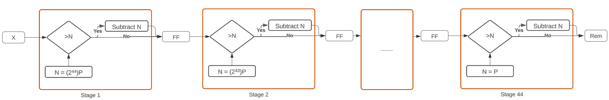
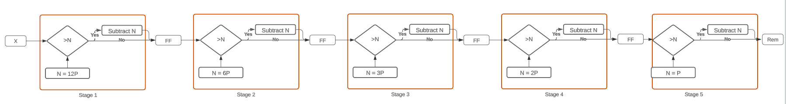

# A modulo machine
##### 
 Nirmal Shah

## Interface:-
-Input Clock (1b)
-Input Reset (1b)
-Input X (300b)
-Output O (256b)

We need to calculate X%P where P is a 256 bit prime number.
P = 104899928942039473597645237135751317405745389583683433800060134911610808289117

I have tried to solve the problem using 3 different approaches. All the methods are tested and built using Vivado 2023.1. To generate the project just run the TCL files
## [Method A](Method_A/)
The priciple used in this method is division as a repeated subtraction. The architecture consists of 44 pipelined stages, and in each stage we compare and subtract the residual number.
We exploit the fact that any 300 bit number can we written as

$$
\begin{aligned}
X &= Rem + 2^{44}q_{44}P + 2^{43}q_{43}P + 2^{42}P + ... + {q_0}P & \text{where } q_{44}, q_{43},...q_0 \in \{0,1\}
\end{aligned}$$ Hence
$$\begin{aligned}
Rem = X - 2^{44}q_{44}P - 2^{43}q_{43}P - 2^{42}P - ... - {q_0}P
\end{aligned}$$ 
In each stage of the pipeline, X is being subtracted, and its ensured that it never goes negative.   Since P is fixed, we pre-compute all the fixed coefficients, and store them in FFs. The number of pipeline stages can be controlled by changing the number of subtractions that we want to perform in single CLK cycle

#### File structure
- [Method_A.tcl](Method_A/Method_A.tcl) - TCL script to generate the project.
- [sims.wdb](Method_A/files/sims.wdb) - Post synthesis simulation waveform
- [verilog_gen.ipynb](Method_A/files/verilog_gen.ipynb) - File to generate Verilog code
- [TB.ipynb](Method_A/files/TB.ipynb) - Python file to generate the test cases.

#### Timing Summary
- CLK period of 10ns was used.
- Worst negative slack = 2.142ns
- Worst Hold slack = 0.159ns

#### Utilization
- LUTs = 23906
- FFs = 12510  

## [Method_B](Method_B/)
Use the inbuilt "%" operator inside the Verilog, and let the synthesizer automatically decide the architecture. 

#### File structure
- [Method_B.tcl](Method_B/Method_B.tcl) - TCL script to generate the project.
- [sims.wdb](Method_B/files/sims.wdb) - Post synthesis simulation waveform
#### Timing Summary
- CLK period of 10ns was used
- The timing constraints were not met, since it was an entire combinational circuit.
- CLK period had to be raied to 40ns, to achieve Worst Negative slack = 2.28ns, and meeting the timing constraints
#### Utilization
- LUTs = 9359
- FFs = 256

## [Method_C](Method_C)

This method is simmilar to Method_A, but we reduce the size of X, before finding out the modulo. We exploit the fact that 
$$
\begin{aligned}
(a+b)\%P = ((a\%P)+(b\%P))\%P
\end{aligned}$$Define S
$$
\begin{aligned}
S = (X[299](2^{299}\%P) + X[298](2^{298}\%P) + ... + X[0](2^{0}\%P) )
\end{aligned}$$

The number X%P can again be written as 
$$
\begin{aligned}
X\%P &= S\%P
\end{aligned}$$ Where X[i] are the bits of X.

We would precompute the values of (2^{i}%P), and would only add them if X[i] is 1.

The worst case would be when all the X[i] = 1, leading to the value of S to be maximum of 261 bits. Hence we are able to reduce the problem of finding the modulo of 300 bit number to a 261 bit number. Since P is fixed, the value of S is found to be < 25P.
Since its less than 25P, we can use pipelined algorithm simmilar to Binary search. We can change the depth of the pipeline by parallelzing the subtractions.

#### File structure
- [Method_C.tcl](Method_C/Method_C.tcl) - TCL script to generate the project.
- [sims.wdb](Method_C/files/sims.wdb) - Post synthesis simulation waveform
- [verilog_gen.ipynb](Method_C/files/verilog_gen.ipynb) - File to generate Verilog code
#### Timing Summary
- CLK period of 10ns was used.
- Worst negative slack = 1.549ns
- Worst Hold slack = 0.140ns

#### Utilization
- LUTs = 12095
- FFs = 8448  

## Summary
Summarizing the 3 methods used

|       | Method_A | Method_B     | Method_C |
| :----:        |    :----:   |          :---: | :---:|
| Pipelined      | Yes(44 stages)       | No(Pure Combinational)   | Yes(11 stages) |
| LUT Utilzation   | 23906        | 9359  | 12095|
| FF Utilization|12510|256|8448|
|CLK Period|10ns|40ns|10ns|
|Number of additions performed|44| - | 304 |

## Further Work
The famous Barrett Reduction can be used to calculate the remainder, but the main bottleneck are the multiplications with the constants.

We can use NTT(Number Theoretic Transform) to multiply the 2 numbers, having the Time complexity O(nlogn) where n are the number of bits. Various architectures of NTT and Barrett Reduction needs to be explored.

